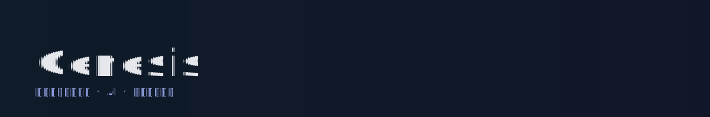
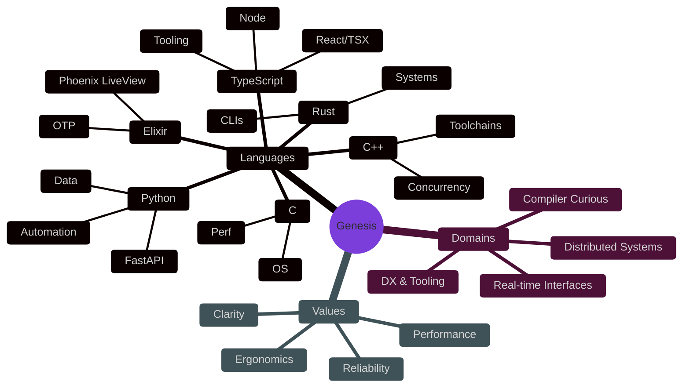

<p align="center">
  
</p>

<p align="center">
  
</p>

<p align="center">
  <a href="https://github.com/gns-x"></a>
</p>

## Signal

- Role: Software Engineer
- Languages I think in: TypeScript • Python • C • C++ • Rust • Elixir
- Interests: AI systems, LangChain, agents, RAG, tool-use, orchestration, LLM evals

## Constellation of Craft



 

## Signature Kata (one idea, six tongues)

<details>
<summary><b>TypeScript</b> — ergonomic edges</summary>

```ts
export function stabilize<T>(items: T[], key: (x: T) => string): T[] {
  const seen = new Set<string>();
  return items.filter(item => {
    const k = key(item);
    if (seen.has(k)) return false;
    seen.add(k);
    return true;
  });
}
```
</details>

<details>
<summary><b>Python</b> — expressive minimalism</summary>

```python
from typing import Callable, Iterable, TypeVar
T = TypeVar("T")

def stabilize(items: Iterable[T], key: Callable[[T], str]) -> list[T]:
    seen: set[str] = set()
    out: list[T] = []
    for x in items:
        k = key(x)
        if k in seen:
            continue
        seen.add(k)
        out.append(x)
    return out
```
</details>

<details>
<summary><b>C++</b> — zero‑cost abstractions</summary>

```cpp
#include <unordered_set>
#include <vector>
template <typename T, typename F>
std::vector<T> stabilize(const std::vector<T>& items, F key) {
  std::unordered_set<std::string> seen;
  std::vector<T> out;
  out.reserve(items.size());
  for (const auto& x : items) {
    auto k = key(x);
    if (seen.insert(k).second) out.push_back(x);
  }
  return out;
}
```
</details>

<details>
<summary><b>Rust</b> — fearless correctness</summary>

```rust
use std::collections::HashSet;
pub fn stabilize<T, F>(items: impl IntoIterator<Item = T>, mut key: F) -> Vec<T>
where
    F: FnMut(&T) -> String,
{
    let mut seen = HashSet::new();
    let mut out = Vec::new();
    for x in items {
        let k = key(&x);
        if seen.insert(k) {
            out.push(x);
        }
    }
    out
}
```
</details>

<details>
<summary><b>Elixir</b> — concurrent clarity</summary>

```elixir
defmodule Genesis do
  def stabilize(items, key) do
    Enum.reduce(items, {MapSet.new(), []}, fn x, {seen, out} ->
      k = key.(x)
      if MapSet.member?(seen, k), do: {seen, out}, else: {MapSet.put(seen, k), [x | out]}
    end)
    |> elem(1)
    |> Enum.reverse()
  end
end
```
</details>

## Live Signals

<p align="center">
  
  
</p>

---

If you’ve read this far, we should probably build something together.

